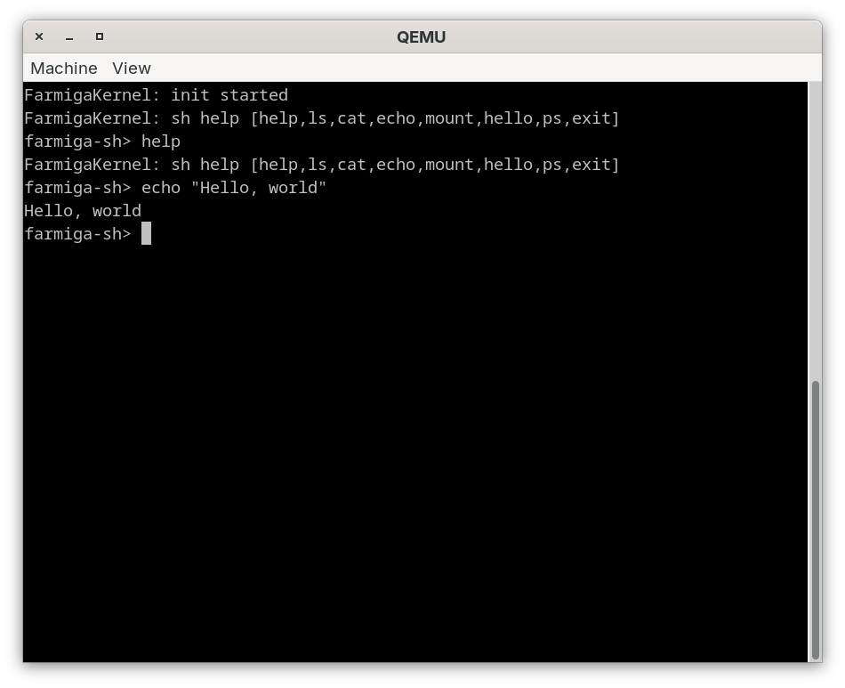

# Farmiga



Farmiga is a UNIX SysV-inspired hobby kernel project with:
- `aarch64` as the primary boot target
- `x86_64` as a planned second target
- kernel logic authored in Coatl where practical

This repository currently provides a Stage 0 foundation:
- Bootable AArch64 kernel entry and UART console on QEMU `virt`
- EL1 trap capture scaffold (`ESR_EL1`/`ELR_EL1`/`SPSR_EL1`) with SVC classification and syscall-number routing markers
- Stable trap snapshot ABI symbols exported for future Coatl trapframe bridge (`trap_snapshot_base..trap_snapshot_end`)
- SysV-like syscall dispatch core written in Coatl
- In-memory FS + init/exec + shell-command model layer in Coatl (`echo`, `ls`, `cat`, `mount`, `ps`)
- Build wiring for incremental migration of low-level kernel paths to Coatl

## Layout

- `arch/aarch64/boot.S`: reset entry, stack setup, UART console output
- `arch/aarch64/linker.ld`: bare-metal linker script
- `kernel/sysv_kernel.coatl`: SysV-inspired syscall/process core model in Coatl
- `userland/minish.coatl`: minimal `init` + shell-command model smoke in Coatl
- `Makefile`: build/run/smoke targets
- `docs/SYSV_PLAN.md`: staged plan from Stage 0 to multi-process SysV-like kernel
- `docs/PROGRESS.md`: dated implementation log and blockers

## Requirements

- GNU binutils for AArch64 (`aarch64-none-elf-as`, `aarch64-none-elf-ld`, `aarch64-none-elf-objcopy`) or compatible prefix
- `qemu-system-aarch64`
- Coatl compiler at `~/Projects/Coatl/coatl` (or set `COATL`)

The Makefile auto-detects `aarch64-none-elf-` and `aarch64-linux-gnu-` prefixes.
If your tools use a different prefix, override it:

```bash
make CROSS=<your-prefix> validate
```

## Quick Start

Build AArch64 ELF + raw image:

```bash
make aarch64
```

Build experimental x86_64 ELF + raw image (secondary target scaffold):

```bash
make x86_64
```

Run x86_64 scaffold build contract smoke:

```bash
make test-x86_64-build
```

Run experimental x86_64 QEMU loader smoke:

```bash
make test-x86_64-qemu-smoke
```

Run interactive x86_64 loader path:

```bash
make run-x86_64-loader
```

Run on QEMU:

```bash
make run-aarch64
```

You should see:

```text
Farmiga: aarch64 stage0
```

On normal boot, Farmiga now enters a minimal serial shell prompt:

```text
farmiga-sh>
```

Line-based demo commands:
- `help`
- `ls`
- `cat`
- `echo`
- `mount`
- `ps`
- `exit`

`exit` currently returns to the prompt (no poweroff yet).

Automated QEMU validation (recommended for every change):

```bash
make test-aarch64
```

This command boots the kernel in QEMU, captures serial output, and fails if the expected boot banner is missing.

Automated SVC trap/syscall-boundary smoke:

```bash
make test-aarch64-svc
```

This builds a temporary trap-test kernel variant (with a startup `svc #0`, `x8=20`) and asserts EL1 syscall-trap classification plus `getpid(20)` syscall routing marker on serial.

Automated syscall-argument observability smoke:

```bash
make test-aarch64-svc-args
```

This builds a trap-test kernel variant (`x8=4`, `x0=1`, `x1=4096`, `x2=16`) and asserts syscall-boundary argument markers on serial.

Automated syscall-return observability smoke:

```bash
make test-aarch64-svc-ret
```

This builds a trap-test kernel variant (`x8=4`, `x2=16`) and asserts the modeled syscall return marker (`x0=16`) on serial.

Automated unknown-syscall routing smoke:

```bash
make test-aarch64-svc-unknown
```

This builds a trap-test kernel variant (`x8=999`) and asserts the unknown-syscall routing marker on serial.

Automated syscall-route matrix smoke:

```bash
make test-aarch64-svc-matrix
```

This runs SVC trap variants for `x8=64`, `x8=1`, and `x8=4`, asserting `getppid`, `exit`, and `write` route markers on serial.

Automated non-syscall trap smoke:

```bash
make test-aarch64-brk
```

This builds a trap-test kernel variant that executes `brk #42` and asserts generic EL1 trap handling is observable on serial.

Trap runtime value smoke:

```bash
make test-aarch64-trap-runtime
```

This asserts trap runtime observability markers from QEMU logs:
- trap kind marker (`sync`) for SVC/BRK paths
- syscall route markers (`getpid`, `unknown`)
- non-syscall route marker (`route none`) for BRK path

Trap fixture contract smoke:

```bash
make test-aarch64-trap-fixture
```

This generates a deterministic trap snapshot fixture from ELF-exported machine constants and validates layout + route fixture values for serialized ingest parity checks.

Coatl fixture parity smoke:

```bash
make test-coatl-trap-fixture-parity
```

This validates the generated fixture values against Coatl trap ABI helper constants in `kernel/sysv_kernel.coatl`.

Generate Coatl trap ABI constants artifact:

```bash
make gen-coatl-trap-abi-constants
```

This emits `build/trap_abi_generated.coatl` from machine-derived fixture constants.

Generated constants sync smoke:

```bash
make test-coatl-generated-trap-abi-sync
```

This checks that generated Coatl constants stay in sync with `kernel/sysv_kernel.coatl` ABI helper functions.

Trap ABI contract smoke:

```bash
make test-aarch64-trap-abi
```

This verifies required trap snapshot symbols exist in the built AArch64 ELF (`last_esr_el1`, `last_elr_el1`, `last_spsr_el1`, `last_x8`, `last_trap_kind`, `last_sys_route`), checks the fixed layout constants, and enforces parity with Coatl-side ABI helpers in `kernel/sysv_kernel.coatl`.
Layout constants:
- size: `trap_snapshot_size=80`
- offsets: `count=0`, `kind=8`, `esr=16`, `elr=24`, `spsr=32`, `x8=40`, `x0=48`, `x1=56`, `x2=64`, `route=72`

Build and run the Coatl SysV core smoke test on `x86_64` host:

```bash
make coatl-sysv-smoke
```

Build and run the Coatl userland (`init`/`sh`) smoke model on `x86_64` host:

```bash
make coatl-userland-smoke
```

Run the full validation suite (includes QEMU boot test):

```bash
make validate
```

Run standalone environment/toolchain preflight:

```bash
make toolchain-preflight
```

## License

This project is licensed under the GNU General Public License v3.0 - see the [LICENSE](LICENSE) file for details.

## Notes

- Coatl AArch64 codegen is still evolving. This repo keeps the machine-entry path in assembly while growing portable kernel logic in Coatl.
- The goal is to move scheduler, syscall table, VFS, and IPC core progressively into Coatl as backend support hardens.
